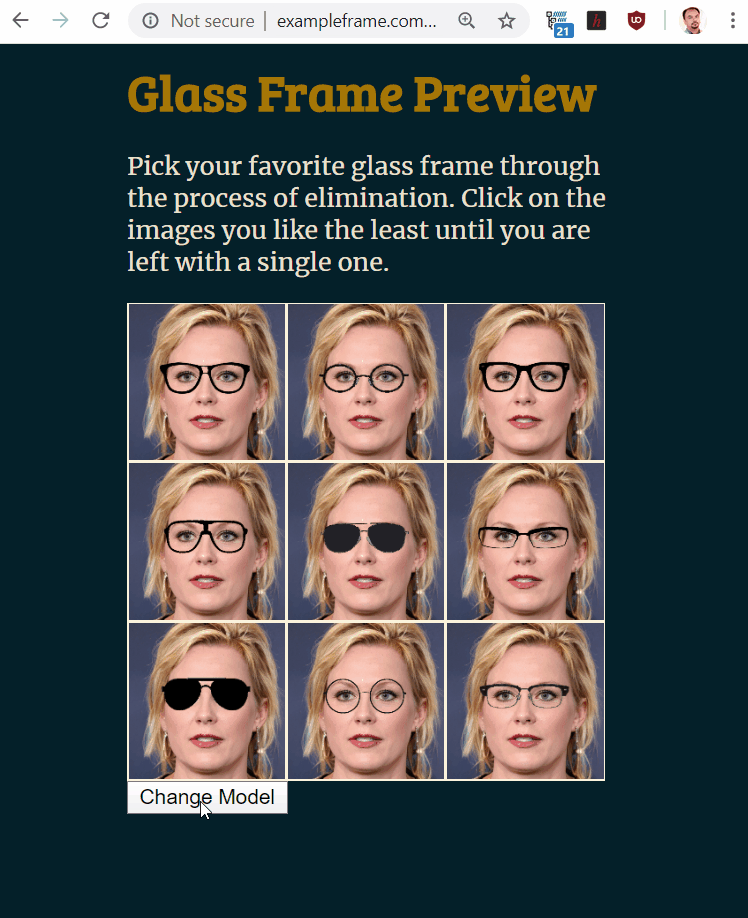

# Glass Frame Preview

## Table of Contents
- [Project Overview](#overview)
- [Project Components](#components)
  - [ETL Pipeline](#etl_pipeline)
  - [ML Pipeline](#ml_pipeline)
  - [Flask Web App](#flask)
  	- [Dataset Visualization](#visual)
  	- [Message Categorization](#category)
- [Usage Instructions](#run)
  - [Data Cleaning](#cleaning)
  - [Training Classifier](#training)
  - [Starting the Web App](#starting)
  	- [Running in localhost](#local)
  	- [ngrok Deployment](#ngrok)
- [Conclusion](#conclusion)
- [Software Requirements](#sw)
- [Files](#files)
- [Credits and Acknowledgements](#credits)

**_Video Demo of the [deployed App](http://exampleframe.com.s3-website.ca-central-1.amazonaws.com/)_**

 

[Back to Table of Content](#index)

## Project Overview
When someone wants to get a new glass frame, he/she has to go through a process of trial and error. Maybe he/she finds some eyeglasses attractive on display in the optical shop, but not so great when he/she try them on. Depending on face shapes, skin tones, hair color and eye color, a certain glass frame looks awesome to a cetain person. So, sometimes it become quite hard for a person to choose a right glass frame in a optial shop. 
Artificial Intelligence (AI) can come as rescue in this scenario. AI is already changing almost every spheres of our lives. With the recent advancement of deep learning technology and easily available cloud computing power, we can leverage AI to help us choose the right frame for us. This webapp will show a basic usage of AI to help a person to choose a right glass frame virtually without all the hassels and dilemma.   

 

[Back to Table of Content](#index)
 
